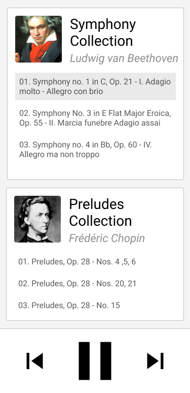

# Music Player

## Pré-requisitos

- Node.js
- Yarn (usar `npm` pode causar erros na instalação dos pacotes)

## Passo 1

- Rodar o comando `yarn`
- Ver o teste "quebrar" rodando `yarn test`
- Escrever as classes para passar nos testes

## Passo 2

- Criar a interface baseada no [protótipo do Figma](https://www.figma.com/file/V2LUvZCm5AW92nCjtCcM8A/Music-Player?node-id=0%3A1)
- Fazer a aplicação responsiva utilizando as classes criadas no passo anterior
- Não utilizar biblioteca de terceiros (apenas vanilla js)
- Testar usando os comandos `yarn start`

## Dicas

- Utilizar os recursos mais novos de JavaScript (ESNext)
- Encapsular as propriedades das classes (impedir valores inválidos em atribuições diretas)

## O que será avaliado

- Todos os testes cumpridos
- Responsividade
- Estrutura do código
- Gerenciamento de estados (store/state/etc)
- Uso de boas práticas (legibilidade, código limpo, etc)
- Funcionalidades adicionais são bem-vindas (use a criatividade)

## Resultado experado

